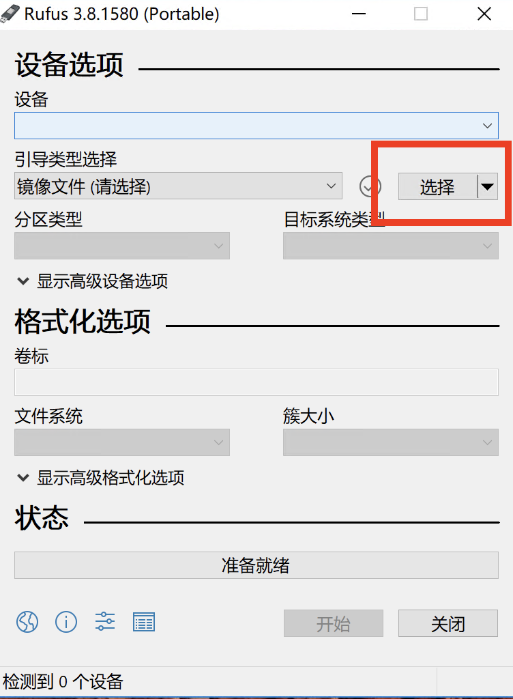

### 在Windows上创建可引导的系统U盘
Linux/MAC系统参考 [在Linux/MAC上创建可引导的系统U盘](create-bootable-usb-linux.md)

> **注意**：请备份U盘数据
> **注意**：此操作将格式化U盘
> **注意**：U盘容量至少为8GB
1. [获取系统安装镜像](get-os-iso.md)([获取DGX OS安装镜像](get_dgxos.md))
2. [获取Rufus软件](https://rufus.ie/);
3. USB闪存驱动器插入Windows系统的USB端口之一。
4. 启动Rufus软件（双击下载完成后的文件即可。）

5. 设备选择U盘
6. 点击`引导类型选择`栏右侧`选择`，选择系统镜像文件
7. 分区类型可选`BIOS`与`UEFI`
   - DGX 设备必须选择UEFI+GPT
   - 其余设备选择类型须与bios设置一致，否则可能不识别引导设备
8. 点击开始。选择“ 以ISO映像模式写入”，然后单击“ 确定”。