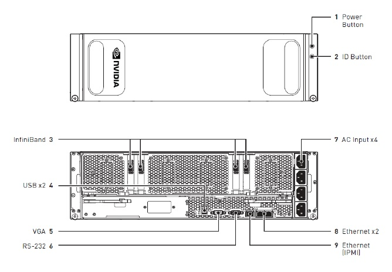

## DGX-1配置指南

> 本文描述DGX-1是指由NVIDIA公司设计和制造的计算设备

###### 相关阅读：
[netplan网络配置](netplan.md)

[BMC配置](dgx-bmc.md)
 
[DGX-1重置GPU](dgx1-reset-gpu.md)

[DGX配置NFS缓存](dgx1-nfs-cache.md)

[使用ipmitool工具](ipmitool.md)

[更改Mellanox卡端口类型](change_ib_type.md)

[重新安装DGX OS](dgx1-os-reinstall.md)

### DGX-1硬件配置
#### 系统组件
组件 | 数量 | 配置 | 
---|---|---
CPU主板 | 1|  Dual Intel® Xeon® CPU motherboard with x2 9.6 GT/s QPI, 8 Channel with 2 DPC DDR4, Intel®C610 Chipset, AST2400 BMC
GPU主板 | 1|  GPU Baseboard supporting 8 SXM2 modules (Cube Mesh) and 4 PCIE x16 slots for InfiniBand/Ethernet NICs
电源 | 4 | 1600w负载平衡电源，具有3 + 1冗余
CPU |2| E5-2698 v4 20 cores 2.2GHz 135W
GPU | 8|(Volta 32 GB）Tesla V100 
内存 | 16|32 GB DDR4 LRDIMM(总计512GB)
raid控制器 |1| 8端口LSI SAS 3108 
存储（缓存 raid0 ）|4|  1.92 TB，6 Gb / s，SATA 3.0 SSD
存储（操作系统）| 1| 480 GB，6 Gb / s，SATA 3.0 SSD
以太网卡| 2 | 双端口10GBASE-T网络适配器
InfiniBand EDR / 100GbE NIC |4 | 单端口，x16 PCIe，Mellanox ConnectX-5 VPI MCX555A-ECAT

#### 机械特征
 特征 | 细节
 ---|---
 主机|3U机架式
 高度|13.1厘米
 宽度|44.4厘米
 深度|86.6厘米
 重量|61公斤

#### 环境要求
特征 | 细节
 ---|---
 工作温度|5-35摄氏度
 相对湿度|20％至85％不凝结
 热量输出|12000 BTU /小时

#### 电源要求
输入 | 每个电源规格 | 注释
 ---|---|---
 200-240 V（交流）3500 W|1600 W @ 200-240 V，8 A，50-60Hz |四个负载平衡电源，3 + 1冗余结构

#### 连接与控制

ID | 类型 | 数量 | 描述
 ---|---|---|---
 1|电源按钮|1|按下以打开或关闭DGX-1。蓝色：系统开机;灭：系统电源关闭;黄色（闪烁）：直流电关闭且出现故障；黄色和蓝色闪烁）：直流电接通且出现故障
 2|ID按钮|1|在维修过程中，按此按钮可使本机背面的LED闪烁作为标识符。
 3|InfiniBand /以太网（QSFP28）|4|EDR IB / 100GbE
 4|USB|2|	USB 3.0端口可用于连接键盘。
 5|显示输出|1|	VGA端口连接到具有VGA功能的监视器，以便在本地查看DGX-1安装控制台或基本OS。
 6|DB9|1|	RS232串行端口，用于内部调试
 7|交流输入	|4|电源输入
 8|以太网路（RJ45）	|2|	10GBASE-T双端口网络适配器夹层
 9|IPMI（RJ45）|1|	10 / 100BASE-T智能平台管理接口（IPMI）端口

