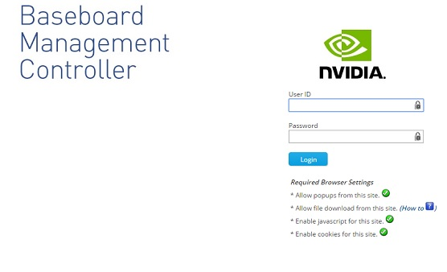
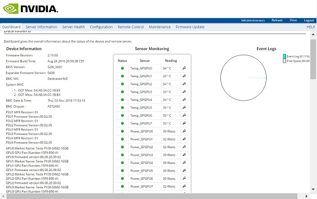
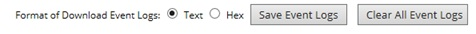
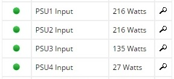
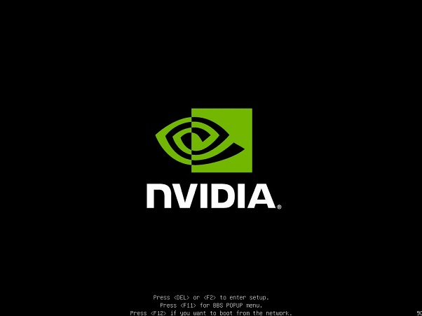
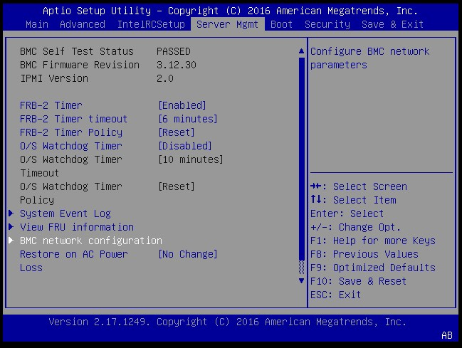
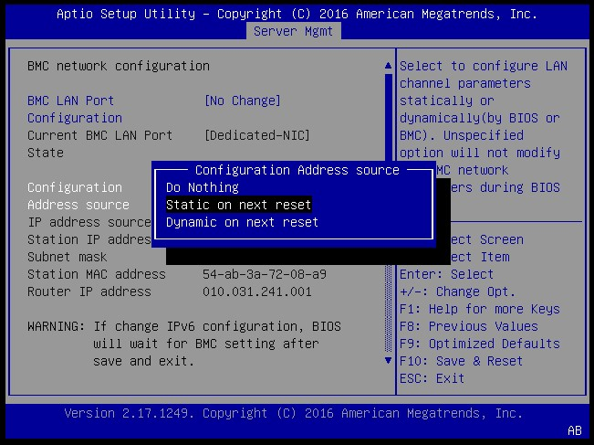
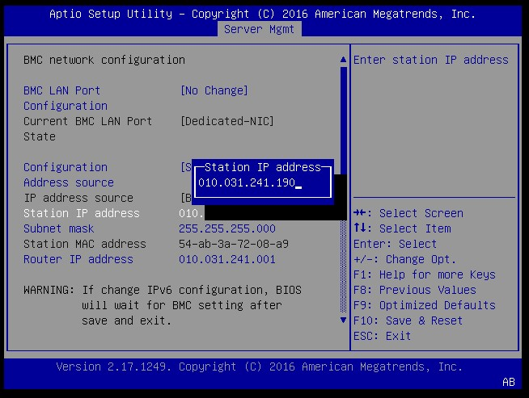
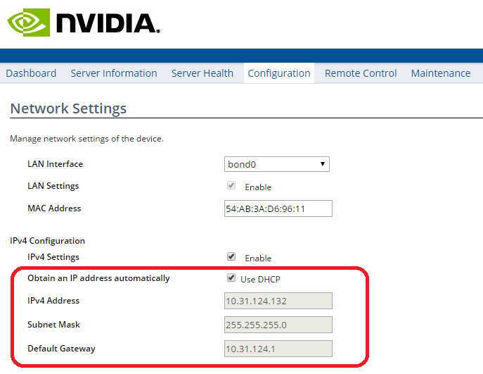

### DGX-1 BMC配置使用

#### 使用BMC

> BMC: 基板管理控制器（BMC），可让您独立于CPU或操作系统来管理和监视服务器主机。您可以通过与IPMI端口的以太网连接来远程访问BMC。

###### 远程访问BMC：
1. 确保已将DGX-1上的IPMI端口连接到局域网。
2. 在局域网中打开一个启用Java的浏览器，然后转到http：// <IPMI IP地址> /。使用Firefox或Internet Explorer。BMC并未正式支持Google Chrome浏览器。

3. 登录。您的初始登录凭据基于您首次设置DGX-1时创建的凭据。输入用户名作为用户ID以及密码。用户ID：<您的用户名>密码：<您的用户名>。
   
> 首次开机时设置DGX-1时，需要设置系统的用户名和密码。这些凭据也用于远程登录BMC，但BMC密码是用户名。

4. 请确保立即更改密码，以确保BMC的安全。

###### 配置BMC密码

5. 在顶部菜单中，单击`Configuration`，然后选择`User`。
6. 选择您的用户名，然后单击`Modify User`。
7. 在`User`对话框中，选择`Change Password`，然后在`Password`和`Confirm Password` 框中输入新密码。
8. 单击`Modify`完成设置。

###### 查看系统信息

> dashboard  显示有关系统和系统组件的信息，例如温度和电压。

###### 提交BMC日志
> BMC提供系统活动和状态的自动日志记录。NVIDIA Enterprise Support(ESP)团队使用日志文件来协助进行故障排除。请按照以下说明获取日志文件，以发送给NVIDIA Enterprise Support。

1. 登录到BMC，然后从顶部菜单中单击`Server Health`，然后选择 `Event Log`。

2. 确保在下载事件日志的格式`"Format of Download Event Logs"`中选择了`Text` 。
3. 点击`Save Event Logs`下载日志

###### 查看总功耗

- 在BMC仪表板中，找到`Sensor Monitoring `区域，然后向下滚动页面，直到看到`PSU Input`行。

- 添加所有PSU的值。在此示例中，总功耗为216 + 216 + 135 + 27 = 594W

###### 访问DGX-1远程控制台
1. 登录到BMC。
2. 在顶部菜单中，单击`Remote Control`，然后选择`Console Redirection`。
3. 击`Java Console`以打开弹出窗口。该窗口提供了DGX-1控制台的交互式控制。
4. 在JViewer顶部菜单中，单击`Power`，然后根据要执行的操作从可用选项中进行选择。

5. 单击选项，然后在电源控制对话框中单击`OK` ，然后等待系统执行预期的操作。

###### [使用ipmitool配置BMC](ipmitool.md)

###### 使用bios配置静态BMC地址
> 本节介绍无法远程访问DGX-1时如何为BMC设置静态IP地址。此过程涉及在系统引导期间设置BMC IP地址。

1. 将键盘和显示器（1024x768或更高分辨率）连接到DGX-1，然后打开DGX-1。
2. 当您看到NVIDIA徽标时，按`Del键`进入BIOS Utility Setup屏幕。

3. 在BIOS Setup Utility屏幕上，导航到顶部菜单上的`Server Mgmt`选项卡，然后滚动到`BMC network configuration`并按Enter。

4. 滚动到`Configuration Address Source`，然后按 Enter，然后在`Configuration Address Source`弹出窗口中，选择`Static on next reset`(DHCP选择`Dynamic on nect reset`)，然后按Enter。

5. 根据需要设置IP地址，子网掩码和路由器IP地址的地址：
   - 滚动到特定项目，然后按 Enter。
   - 在弹出窗口中输入适当的信息，然后按Enter。

6. 完成所有更改后，按F10键保存并重置，然后在确认弹出窗口中选择`Yes`，然后按Enter键。
现在，您可以通过网络访问BMC。

###### 使用BMC Dashboard配置BMC静态IP地址

1. 登录到BMC，然后从顶部菜单中单击`Configuration`，然后选择`Network Settings`
2. 在`Network Settings`页面的`IPv4 Configuration`，取消`use DHCP`复选框，然后为`IPv4 Address`，`Subnet Mask `和`Default Gateway `字段输入适当的值。

3. 完成后单击`Save`