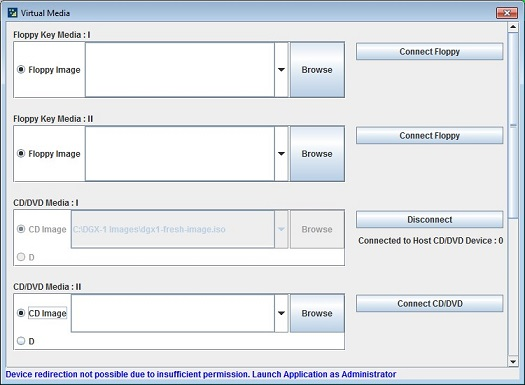
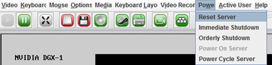

### 重新安装/升级DGX OS
> 如果DGX-1软件映像损坏，或者在故障后更换了OS SSD，请从原厂系统镜像将DGX-1软件系统恢复到其原始出厂状态

还原DGX-1软件映像的过程如下：

1. 从NVIDIA Enterprise Support 获取包含映像的ISO文件。具体方法参考：[获取DGX软件镜像说明](https://docs.nvidia.com/dgx/dgx1-user-guide/maintenance.html#obtain-product-software-iso-image)
2. 通过BMC远程或从可引导USB闪存驱动器从此文件中还原DGX-1软件映像。

#### 获取DGX-1软件ISO映像和校验和文件
> 为确保还原DGX-1软件映像的最新可用版本，请从NVIDIA Enterprise Support获得最新的ISO映像文件。
1. 登录到NVIDIA Enterprise支持站点。
2. 单击`Announcements`选项卡，找到DGX-1软件映像的下载链接。
3. 下载ISO映像及其校验和文件，并将其保存到本地磁盘。
4. 
#### 通过BMC重新安装系统
1. 连接到BMC
   在局域网中打开一个启用Java的Web浏览器，然后转到 `http：// IPMI-IP地址 /`，然后登录。
2. 将ISO映像设置为虚拟媒体
   1. 在顶部菜单中，单击`Remote Control`，然后选择`Console Redirection`。
   
   2. 单击`Java Console`以打开远程JViewer窗口。 确保此站点禁用了弹出窗口阻止程序。
   3. 在JViewer顶部菜单栏中，单击`Media`，然后选择`Virtual Media Wizard`。
   
   4. 在`CD/DVD Media`对话框中选择`Virtual Media`部 ，单击`Browse`，然后找到映像ISO文件，然后单击`Open`。
   5. 单击`Connect CD/DVD`，然后单击`OK ` 。
   
   6. 关闭窗口。菜单栏中的CD ROM图标变为绿色，表示已附加ISO映像。
   
3. 重新启动，安装映像，然后完成DGX-1的安装。
   1. 在顶部菜单中，单击`Power`，然后选择`Reset Server`
   
   2. 在启动选择屏幕上，选择`Install DGX Server`。 
   >如果您是不使用RAID磁盘作为缓存的高级用户，并且希望将数据保留在RAID磁盘上，则选择`Install DGX Server without formatting RAID.`。
   3. 按Enter键。DGX-1将从CDROM重新启动，然后继续安装映像。这大约需要15分钟。
   > 注意：更新Mellanox InfiniBand固件可能需要10分钟。
4. [首次设置DGX-1](dgx1-first.md)