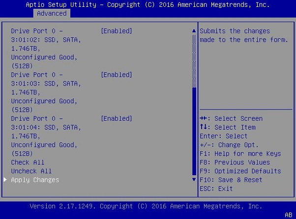

### 持久化DGX-1的数据存储/更改raid级别

> DGX-1包含4 * 1.92TB数据缓存分区（raid0），该分区默认不能作为数据储存。要使用该分区进行数据存储，需更改该分区raid级别

> **注意**：该操作会损坏现有数据，操作前请做好备份

1. 备份全部数据
   > 请备份您的数据至其他存储设备
2. 删除现有raid0
   1. 将显示器（1024x768高分辨率）和键盘连接到DGX-1。或通过[BMC远程控制台访问](dgx-bmc.md)
   2. 重新启动DGX-1
   3. 在NVIDIA引导屏幕上，按`F2`或`Del`进入BIOS设置屏幕。
   4. 从顶部菜单中选择Advanced选项卡，然后向下滚动并选择`MegaRAID Configuration Utility`。
   
   5. 出现RAID配置菜单。
   
   6. 选择主菜单，然后选择`Virtual Drive Management`。
   7. 选择并删除7TB的磁盘组
3. 重新创建raid5
   1. 导航至RAID Utility主菜单，然后选择`Configuration Management.`
   
   2.  选择`Create Virtual Drive,`。
   
   1.  滚动到“ 选择RAID等级”，然后切换到[RAID5]
   
   2.  滚动到选择媒体类型，然后切换到[SSD]
   
   3.  选择1.7TB的驱动器。
   
   4.  选择“ 应用更改”。
   5.  将Confirm更改为`Enabled`，然后选`Yes`
   
   6.  确认摘要符合您的选择，然后选择保存配置。