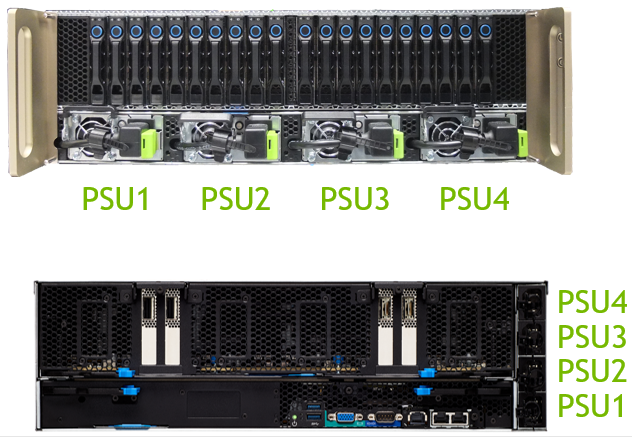
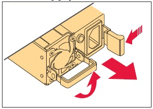

### DGX-1更换电源/电源故障检查

###### DGX-1设备前面板、后面板对应方式

1. 如DGX-1设备突然啸叫，请检查PSU电源指示灯，并根据上面对应图检查电源线是否连接牢固
2. 如确定电源模块损坏，请联系[NVIDIA支持服务](esp.md)
3. 待收到新的电源模块后，按照下列方式更换：
   1. 如果尚未卸下挡板，请抓住侧面的把手，将挡板卸下，然后将挡板从DGX-1的正面垂直拉出。
   2. 拔下电源线。
   3. 翻转电源手柄。
   
   4. 将绿色释放杆向左推，同时使用电源手柄拉出电源。
   5. 将新的电源滑入托架并推入直至就位。
   6. 翻转电源手柄使其与电源相对。
   7. 重新连接电源线。
   8. 重新装上挡板。 定位好挡板
> 注意：卸下或安装挡板时，请小心不要意外按下DGX-1右边缘的电源按钮。

