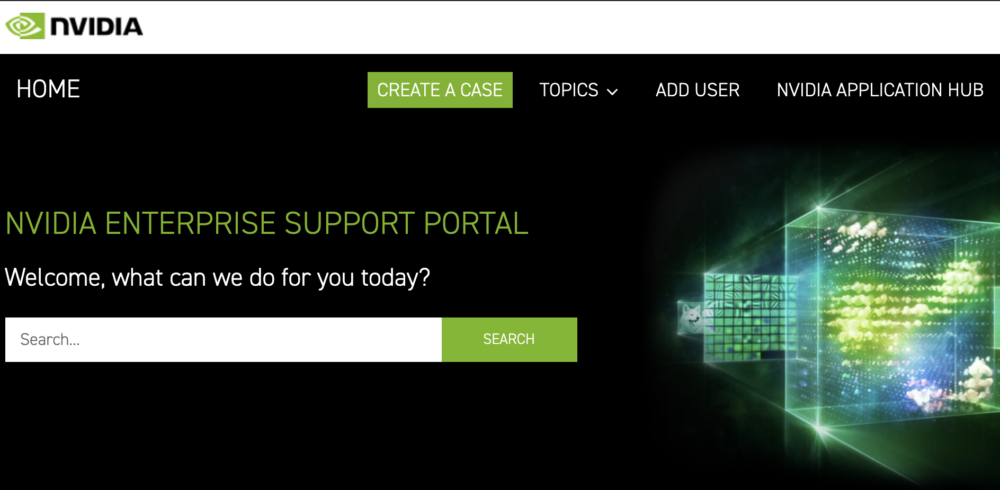
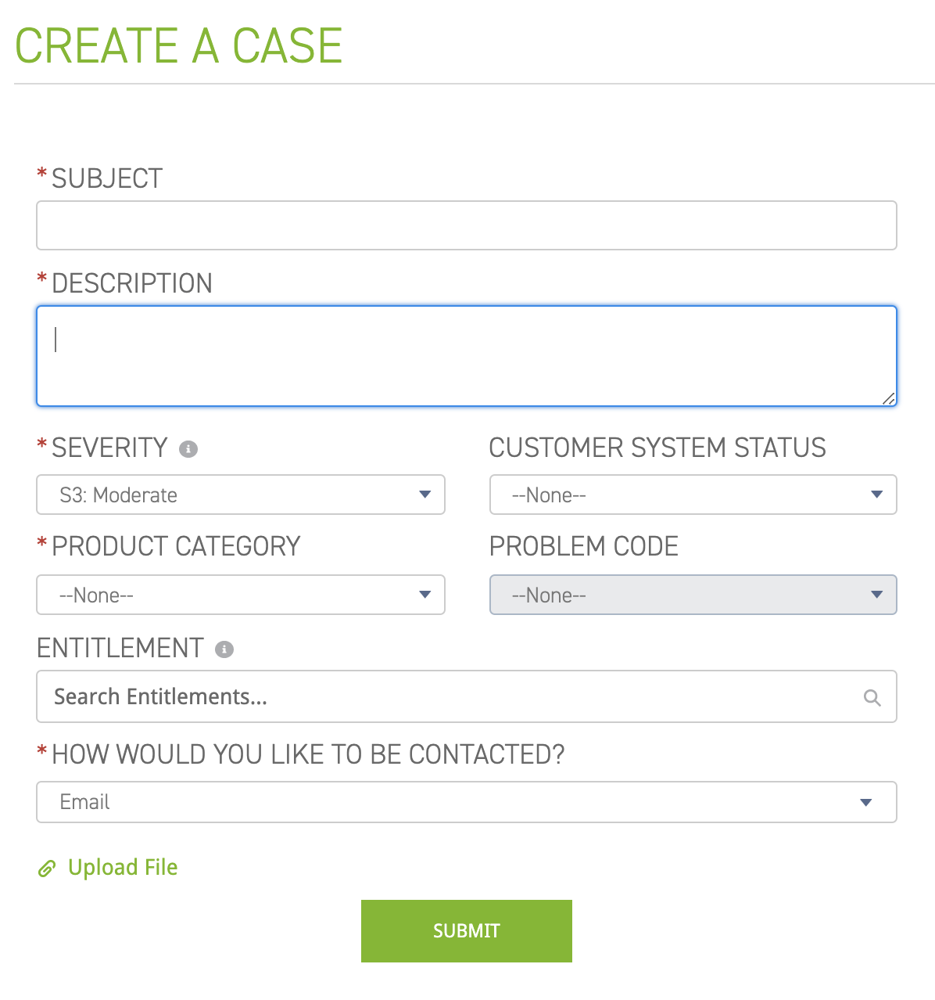

### DGX设备故障申报流程/售后处理流程

> #### DGX系列设备支持服务包括：
>1. **硬件保障**
>     1. 对于用户在常规条件下使用系统出现的硬件故障，经英伟达技术人员确认需要更换硬件的情况，所需更换的硬件将在第二个工作日内发往客户地点 (高级 RMA 服 务)
>    2. 作为高级 RMA 服务的一部分，如需英伟达技术人员提供现场支持，英伟达技术人员将在第二个工作日内抵达客户现场提供技术支持服务。所有出差及人员成本由英伟达承担
>     3. 7X24 小时硬件问题远程技术支持，诊断，问题解决，如需更换硬件时启动高级 RMA 服务。
>2. **7X24 小时在线及热线电话支持服务**
>    1. 用户可通过 NVIDIA 企业支持门户(https://enterprise-support.nvidia.com/s/)7X24 在线提交服务请求，NVIDIA 技术支持工程师保障在 4 小时之内做出反应。
>     2. 提供 7X24 用户支持热线(只限英文)，用户可随时拨打:108007440746 (支持移 动电话); 108004400815 (支持有线电话)取得技术支持服务。
>     3. 用户也可以通过邮件方式发送技术服务请求，发送邮件至 NVIDIA 技术支持邮箱: EnterpriseSupport@nvidia.com
>3. **软件升级保障与支持及在线技术资源**
>    1. 用户可以 7X24 接入并使用英伟达企业支持门户(https://enterprise- support.nvidia.com/s/)，访问英伟达在线可查询知识库，了解软件更新与升级信息并在线下载操作系统及驱动等预装软件的更新或升级版本。
>    2. 获得 NVIDIA NGC(https://ngc.nvidia.com/catalog/all)管理员账户权限，可用于 NGC 企业客户内部用户管理，访问 NGC 容器化软件镜像库，以及下载容器化软件镜像和上传保存客户定制化的容器化软件镜像功能。
>    3. 提供软件堆栈 7X24 小时远程技术支持服务，软件堆栈包括系统预装软件，以及 NGC 容器化软件
>
>
#### DGX硬件故障处理流程

> 无法开机等严重错误，直接通过下面第二步提交问题即可
> 
1. 准备日志文件
   1. 系统日志：
   `sudo nvsysinfo` 或者 `sudo nvsm dump health`
   1. NVhealth
   `sudo nvhealth`
   1. BMC 
   [获取BMC日志](dgx-bmc.md#提交BMC日志)
   1. 导出以上日志文件
2. 提交问题
   - 使用邮件方式申请售后
   1. 准备以下资料：
   ```
        DGX unit serial number:
        Organization name:
        Address:
        City:
        State:
        Zip:
        Contact Person:
        Contact Email Address:
        Contact Phone Number:

   ```
   1. 添加上述日志为附件
   2. 发送上述内容至`enterprisesupport@nvidia.com`
   - 使用ESP网站申请售后
    1. 登录ESP网站[https://enterprise-support.nvidia.com/s/](https://enterprise-support.nvidia.com/s/)
   
    1. 点击`CREATE A CASE`
   
   ```
   SUBJECT: 主要问题
   DESCRIPTION： 问题描述
   SEVERITY： 严重程度，根据问题具体情况选择
   PRODUCT CATEGORY： 产品种类
   HOW WOULD YOU LIKE TO BE CONTACTED? 联系方式（可选邮件、电话）
   ```
    2. 上传日志文件
   点击 `Upload File` 
3. 等待回复