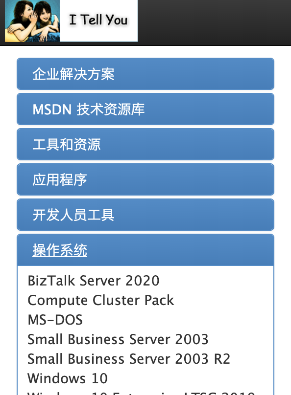
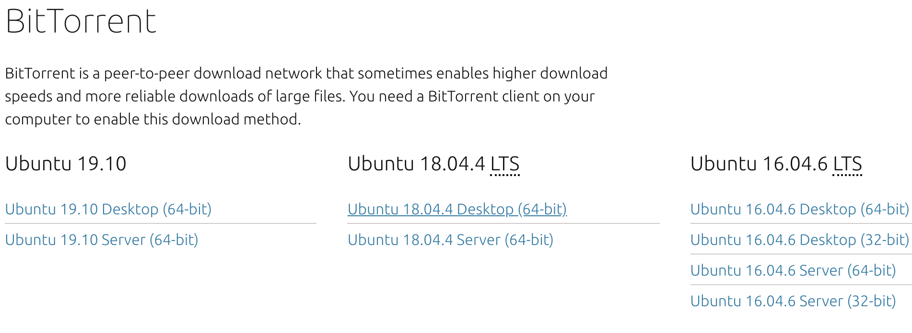
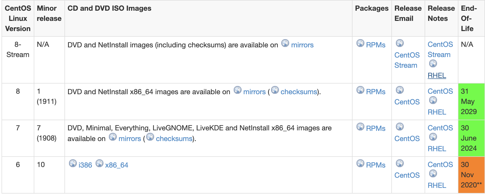
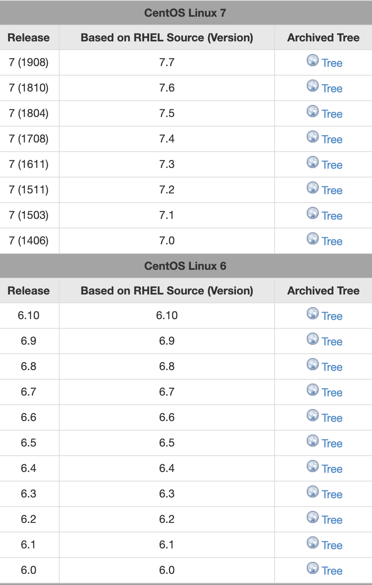

获取系统安装镜像

1. windows：[I Tell You网站](https://msdn.itellyou.cn/) 
2. [Ubuntu官方网站](https://ubuntu.com/download/alternative-downloads)
   
3. [Centos官方网站](https://wiki.centos.org/Download)

centos 小版本列表

4. DGX设备请参考[获得DGX OS](get_dgxos.md)